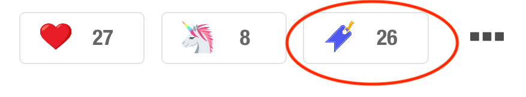

# DevToPocket

Firefox extension to send your DEV.to reading list to Pocket.

You need to be logged in to https://getpocket.com for this extension to work.

## TODO

* Detect if you're removing an item from the reading list
* Add a button in the actual reading list https://dev.to/readinglist